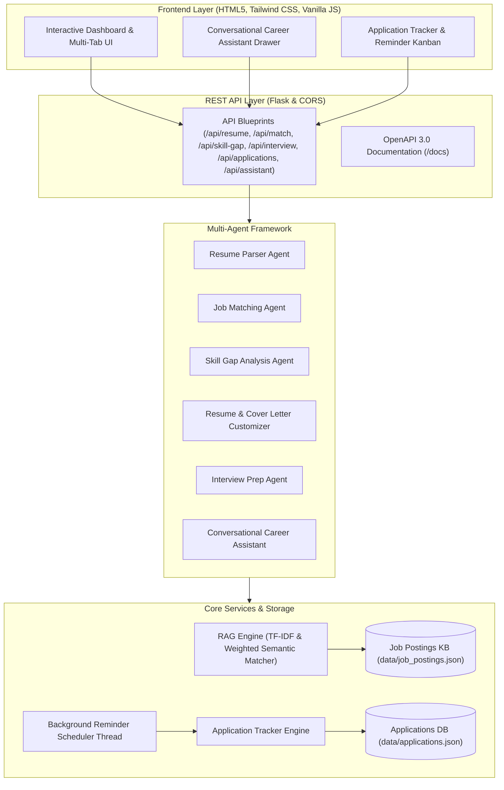
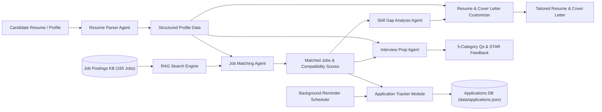
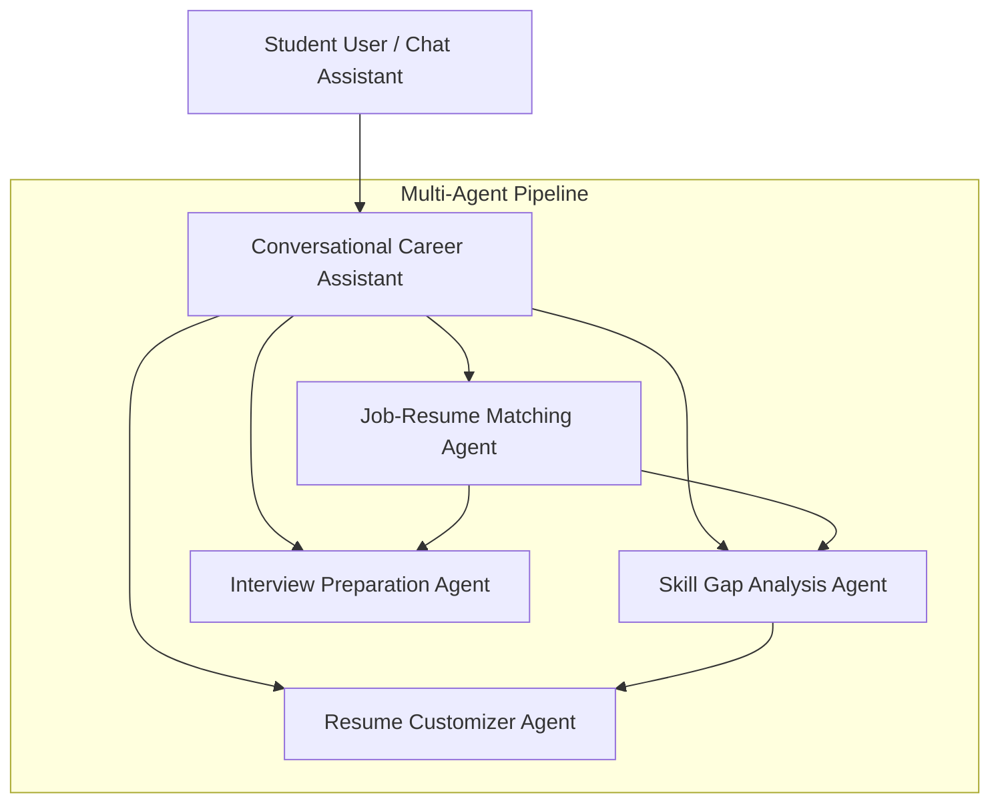

# AI Career Companion Agent

> An end-to-end multi-agent AI system for student internship matching, skill gap remediation, anti-hallucination resume customization, STAR-method interview preparation, application lifecycle tracking, and conversational career assistance.


---

## Table of Contents

- [Introduction and Problem Statement](#introduction-and-problem-statement)
- [Objectives](#objectives)
- [Key Features](#key-features)
- [System Requirements](#system-requirements)
- [System Architecture](#system-architecture)
- [Dataset and Knowledge Base](#dataset-and-knowledge-base)
- [RAG Pipeline](#rag-pipeline)
- [Multi-Agent Architecture](#multi-agent-architecture)
- [Application Tracking Module](#application-tracking-module)
- [Tech Stack](#tech-stack)
- [Project Structure](#project-structure)
- [Getting Started](#getting-started)
- [Usage and Demo Walkthrough](#usage-and-demo-walkthrough)
- [API Reference](#api-reference)
- [Testing and Evaluation](#testing-and-evaluation)
- [Optimization and Results](#optimization-and-results)
- [Documentation](#documentation)
- [Limitations and Future Scope](#limitations-and-future-scope)
- [Conclusion](#conclusion)
- [Contributing, License, Author/Contact](#contributing-license-authorcontact)

---

## Introduction and Problem Statement

Searching for technical internships is often a fragmented and stressful process for students. Candidates frequently submit generic resumes to dozens of job portals without knowing how well their technical skills align with job requirements. They struggle to identify specific skill gaps, lack tailored interview preparation, and fail Applicant Tracking System (ATS) screens due to unoptimized resumes. Furthermore, tracking application stages, upcoming deadlines, and interview schedules across spreadsheet trackers is disorganized.

The **AI Career Companion Agent** solves these challenges by providing a unified multi-agent system. It indexes internship opportunities into a searchable knowledge base, computes multi-factor compatibility scores, performs anti-hallucination resume and cover letter customization, generates STAR-method interview practice questions, and automates full-lifecycle application tracking with background reminders.

---

## Objectives

- **Automated Resume Parsing**: Extract candidate contact details, technical skills, soft skills, projects, and education from PDF, DOCX, TXT, or JSON uploads.
- **RAG Internship Retrieval**: Retrieve semantically relevant internship postings using a field-weighted RAG search engine over 165+ indexed postings.
- **Explainable Job Matching**: Calculate multi-factor compatibility scores based on skill overlap (45%), project relevance (25%), domain alignment (20%), and education (10%).
- **Skill Gap Remediation**: Identify critical missing and partial skills, generating 3-phase structured learning roadmaps.
- **Anti-Hallucination Resume Customization**: Generate job-specific resumes and cover letters strictly grounded in candidate profile data without fabricating skills or achievements.
- **STAR Interview Preparation**: Generate 5 categories of interview questions, simulate Easy/Hard difficulty turns, and evaluate candidate answers against key concept rubrics.
- **Application Tracking & Reminders**: Manage applications through 10 lifecycle stages with timestamped status history, background deadline reminders, and an interactive UI dashboard.
- **Conversational Career Assistant**: Provide a context-aware chat drawer with intent classification and multi-turn conversation memory.

---

## Key Features

### Student Profile Management
- Structured profile representation containing candidate name, contact details, technical skills, soft skills, projects (with tech stacks), education, domain preferences, and target roles.
- Pre-loaded sample profile (`data/sample_profile.json`) for instant one-click candidate testing.

### Resume Upload and Parsing
- Multi-format ingestion supporting PDF (via `pypdf`), DOCX (via XML parsing), plain text, and JSON.
- Automated extraction matching raw text against a standardized dictionary of 70+ technical skills spanning languages, frontend, backend, databases, AI/ML, and DevOps.

### Internship Retrieval Using RAG
- Indexed search engine across 165 curated job postings.
- Domain filtering (10 categories) and work mode filtering (Remote, Hybrid, On-site).

### Job-Resume Matching
- Transparent 4-factor compatibility scoring formula ($0-100\%$).
- Automated natural language AI reasoning explaining candidate strengths and actionable recommendations to boost match score.

### Skill Gap Analysis
- Categorizes skill deficiencies into Critical Missing Skills and Partially Demonstrated Skills.
- Generates 3-phase chronological learning roadmaps with recommended documentation reading and mini-projects.

### Resume and Cover Letter Customization
- Tailors candidate resumes to target job requirements while enforcing zero skill fabrication.
- Generates job-specific cover letters highlighting candidate projects.
- Computes ATS Compatibility Scores ($0-100\%$) with keyword match/missing breakdowns.

### Interview Preparation
- Generates questions across 5 categories: Technical, Resume-Based, Project-Based, Role-Specific, and HR/Behavioral.
- Simulates mock interview turns with configurable difficulty levels (Easy vs. Hard).
- Evaluates candidate responses using the STAR method (Situation, Task, Action, Result) with scores and key concepts covered/missed.

### Conversational Career Assistant
- Natural language chat drawer with intent routing (`job_matching`, `skill_gap`, `resume_customize`, `cover_letter`, `interview_prep`, `tracker_reminders`, `tracker_add`, `tracker_update`, `tracker_query`, `general_career`).
- Maintains conversation context across multi-turn sessions.

### Application Tracking & Management
- Lifecycle status stage tracking (`Saved`, `Planning to apply`, `Applied`, `Application under review`, `Shortlisted`, `Interview scheduled`, `Interview completed`, `Offer received`, `Rejected`, `Withdrawn`).
- Enforces valid status transitions and maintains timestamped status history logs.
- Background thread `ReminderScheduler` notifying users of upcoming deadlines (1, 3, 7 day windows) and scheduled interviews.
- Search, filter by status/company, sort by deadline or application date, edit notes, and view aggregate dashboard metrics.

---

## System Requirements

### Software & Operating System
- **Operating System**: Windows 10/11, macOS 10.15+, or Linux (Ubuntu 20.04+).
- **Python**: Version 3.9, 3.10, 3.11, or 3.12.
- **Web Browser**: Google Chrome, Mozilla Firefox, Microsoft Edge, or Safari.

### Hardware
- **CPU**: Dual-core 2.0 GHz or higher.
- **RAM**: 4 GB minimum (8 GB recommended).
- **Disk Space**: 500 MB free space.

### API Keys & Credentials
- **No external paid API keys required**: The core RAG engine, matching algorithms, skill gap analysis, resume customization, interview evaluation, and tracker run locally out of the box using rule-based and TF-IDF models.
- Environment variables can be configured in `.env`.

---

## System Architecture

### Component Architecture Diagram


```mermaid
flowchart TD
    subgraph Frontend["Frontend Layer (HTML5, Tailwind CSS, Vanilla JS)"]
        UI["Interactive Dashboard & Multi-Tab UI"]
        ChatWidget["Conversational Career Assistant Drawer"]
        TrackerUI["Application Tracker & Reminder Kanban"]
    end

    subgraph API["REST API Layer (Flask & CORS)"]
        Routes["API Blueprints (/api/resume, /api/match, /api/skill-gap, /api/interview, /api/applications, /api/assistant)"]
        Swagger["OpenAPI 3.0 Documentation (/docs)"]
    end

    subgraph Agents["Multi-Agent Framework"]
        ParserAgent["Resume Parser Agent"]
        MatchingAgent["Job Matching Agent"]
        SkillGapAgent["Skill Gap Analysis Agent"]
        CustomizerAgent["Resume & Cover Letter Customizer"]
        InterviewPrepAgent["Interview Prep Agent"]
        AssistantAgent["Conversational Career Assistant"]
    end

    subgraph CoreServices["Core Services & Storage"]
        RAG["RAG Engine (TF-IDF & Weighted Semantic Matcher)"]
        Tracker["Application Tracker Engine"]
        ReminderService["Background Reminder Scheduler Thread"]
        JobStore[("Job Postings KB (data/job_postings.json)")]
        AppStore[("Applications DB (data/applications.json)")]
    end

    UI --> Routes
    ChatWidget --> Routes
    TrackerUI --> Routes

    Routes --> Agents
    Agents --> CoreServices
    RAG --> JobStore
    Tracker --> AppStore
    ReminderService --> Tracker
```

### Data Flow Diagram


```mermaid
flowchart LR
    CandidateData["Candidate Resume / Profile"] --> Parser["Resume Parser Agent"]
    Parser --> ProfileJSON["Structured Profile Data"]
    
    ProfileJSON --> Matcher["Job Matching Agent"]
    JobKB[("Job Postings KB (165 Jobs)")] --> RAGEngine["RAG Search Engine"]
    RAGEngine --> Matcher
    
    Matcher --> MatchResults["Matched Jobs & Compatibility Scores"]
    MatchResults --> SkillGap["Skill Gap Analysis Agent"]
    
    ProfileJSON --> Customizer["Resume & Cover Letter Customizer"]
    SkillGap --> Customizer
    
    Customizer --> TailoredDocs["Tailored Resume & Cover Letter"]
    
    ProfileJSON --> InterviewPrep["Interview Prep Agent"]
    MatchResults --> InterviewPrep
    InterviewPrep --> PrepMaterial["5-Category Qs & STAR Feedback"]
    
    MatchResults --> Tracker["Application Tracker Module"]
    Tracker --> AppDB[("Applications DB (data/applications.json)")]
    ReminderThread["Background Reminder Scheduler"] --> Tracker
```

---

## Dataset and Knowledge Base

The system includes a pre-indexed knowledge base stored in `data/job_postings.json`:

- **Total Job Postings**: 165 job postings.
- **Job Categories & Distribution**:
  - AI & Machine Learning: 17 postings
  - Full-Stack Web Development: 17 postings
  - Frontend Web Development: 17 postings
  - Backend & API Engineering: 17 postings
  - Data Science & Analytics: 17 postings
  - DevOps & Cloud Engineering: 16 postings
  - Mobile App Development: 16 postings
  - Cybersecurity & Security: 16 postings
  - UI/UX Design & Product: 16 postings
  - Systems & Embedded Engineering: 16 postings
- **Work Mode Distribution**:
  - Remote: 55 postings
  - Hybrid: 55 postings
  - On-site: 55 postings
- **Data Preprocessing & Indexing**: Each job posting is structured into fields: `id`, `title`, `company`, `domain`, `location`, `work_mode`, `stipend`, `duration`, `min_qualification`, `technical_skills`, `soft_skills`, `responsibilities`, `description`, `interview_rounds`.
- **Chunking Strategy**: Structured field-level document indexing (approx. 150–300 words per JSON job document, 0 overlap across distinct job entries).

---

## RAG Pipeline

1. **Ingestion**: `RAGEngine` loads `data/job_postings.json` upon initialization.
2. **Chunking & Storage**: Each job object forms a distinct searchable document containing job title, domain, technical skills, company, and description text.
3. **Indexing & Term Weighting**:
   - Title matches: 3.0x weight multiplier
   - Technical Skills matches: 2.5x weight multiplier
   - Domain matches: 2.0x weight multiplier
   - Company matches: 1.5x weight multiplier
   - Description matches: 1.0x weight multiplier
4. **Caching**: LRU query cache (`_query_cache`) caches search results to achieve sub-millisecond retrieval.
5. **Retrieval Parameters**:
   - `top_k=15` for role compatibility matching.
   - `top_k=5` for chat assistant responses.
6. **Agent Utilization**: Retrieved job postings supply ground-truth context to the Job Matcher, Skill Gap Agent, Resume Customizer, and Interview Prep Agent.

---

## Multi-Agent Architecture


```mermaid
flowchart TD
    User["Student User / Chat Assistant"]
    
    subgraph AgentSystem["Multi-Agent Pipeline"]
        A1["Job-Resume Matching Agent"]
        A2["Skill Gap Analysis Agent"]
        A3["Resume Customizer Agent"]
        A4["Interview Preparation Agent"]
        A5["Conversational Career Assistant"]
    end
    
    User --> A5
    A5 --> A1
    A5 --> A2
    A5 --> A3
    A5 --> A4
    A1 --> A2
    A2 --> A3
    A1 --> A4
```

### Agent Breakdown

| Agent Name | Responsibility | Inputs | Outputs | Interacting Agents / Tools |
|------------|----------------|--------|---------|---------------------------|
| **Job-Resume Matching Agent** | Calculates compatibility scores and generates AI reasoning | Candidate Profile, Top-K Jobs | Compatibility Scores, Reasoning, Recommendations | `RAGEngine` |
| **Skill Gap Analysis Agent** | Identifies skill deficiencies and creates roadmaps | Candidate Profile, Selected Job | Critical Gaps, Partial Gaps, 3-Phase Roadmap | Matching Agent |
| **Resume & Cover Letter Customizer** | Tailors resume/letter with zero skill fabrication | Candidate Profile, Job, Skill Gap | Tailored Resume Text, Cover Letter, ATS Score | Skill Gap Agent, `RAGEngine` |
| **Interview Preparation Agent** | Generates prep materials and evaluates STAR answers | Candidate Profile, Job, Skill Gap | 5 Question Categories, Revision Plan, STAR Feedback | Skill Gap Agent |
| **Conversational Career Assistant** | Intent classification and context-aware chat routing | User Message, Candidate Profile, Session Context | Response Text, Data Payloads, Action Suggestions | All Agents, `ApplicationTracker` |

---

## Application Tracking Module

The Application Tracking & Management Module ([backend/tracker.py](backend/tracker.py)) manages applications through their complete lifecycle.

### Stored Fields
`id`, `company`, `title`, `description`, `app_date`, `deadline`, `status`, `interview_date`, `interview_status`, `notes`, `resume_link`, `cover_letter_link`, `student_id`, `job_id`, `created_at`, `updated_at`, `status_history`.

### Supported Status Stages
- `Saved`
- `Planning to apply`
- `Applied`
- `Application under review`
- `Shortlisted`
- `Interview scheduled`
- `Interview completed`
- `Offer received`
- `Rejected`
- `Withdrawn`

### Valid Status Transitions
Transition validation is enforced by `VALID_TRANSITIONS` rules in `backend/tracker.py`. Every status update records a timestamped history entry in `status_history`.

### Search and Filter Options
- Search by company name or role title.
- Filter by status stage (`Saved`, `Applied`, `Interview scheduled`, `Offer received`, etc.).
- Sort by `deadline`, `app_date`, `company`, or `title`.

### Deadline Management & Reminders
- Background scheduler `ReminderScheduler` ([backend/reminder_service.py](backend/reminder_service.py)) runs background checks.
- **Deadline Reminders**: Alerts for deadlines occurring within 1, 3, or 7 days (or overdue).
- **Interview Reminders**: Alerts for upcoming scheduled interviews.
- **Follow-up Suggestions**: Reminders for applications submitted $\ge 7$ days ago with pending updates.

### Dashboard Metrics
- Total applications
- Active applications
- Upcoming deadlines
- Interviews scheduled
- Offers received
- Rejected applications
- Status distribution dictionary

---

## Tech Stack

| Category | Technology | Usage in Project |
|----------|------------|------------------|
| **Frontend** | HTML5, Tailwind CSS (CDN), Vanilla JavaScript | Single-page application UI, dark/light theme toggle, interactive charts |
| **Icons & UI** | Lucide Icons, Chart.js | UI icons and dashboard statistical charts |
| **Backend Framework** | Python 3, Flask 3.0+, Flask-CORS 4.0+ | REST API server, blueprint routing, static file hosting |
| **PDF & Document Parsing** | `pypdf`, `zipfile`, `xml.etree.ElementTree` | Extracting text from PDF and DOCX resume uploads |
| **Data Storage** | JSON Files (`data/job_postings.json`, `data/applications.json`) | Persistent knowledge base and application tracker database |
| **Vector DB / RAG** | Custom In-Memory `RAGEngine` | TF-IDF weighted field indexing, cosine term match, query LRU caching |
| **Agent Framework** | Custom Python Multi-Agent Architecture | Rule-based & heuristic multi-agent pipeline with zero hallucination |
| **Scheduler** | Python `threading.Thread` | Background reminder service checking deadline windows |
| **Testing** | Python `unittest` | Unit tests, integration tests, RAG metrics, E2E workflow suite |

---

## Project Structure

```text
career-companion-agent/
├── backend/                         # Backend Python source code
│   ├── app.py                       # Main Flask server entry point & API route wiring
│   ├── rag_engine.py                # RAG search engine with caching & weighted indexing
│   ├── resume_parser.py             # Resume text parsing & skill dictionary extraction
│   ├── agents_core.py               # Baseline matcher & core interview prep agents
│   ├── tracker.py                   # Application Tracker data model & lifecycle logic
│   ├── reminder_service.py          # Background thread reminder scheduler
│   ├── test_system.py               # Unit test suite (30 tests)
│   ├── test_m4_suite.py             # Milestone 4 E2E workflow & RAG metrics test suite (6 tests)
│   ├── optimize_benchmarks.py       # Performance benchmark measurement script
│   ├── swagger_docs.py              # Swagger UI OpenAPI 3.0 blueprint
│   ├── agents/                      # Specialized agent implementations
│   │   ├── __init__.py
│   │   ├── skill_gap_agent.py       # Skill gap analysis & roadmap generation agent
│   │   ├── resume_customizer_agent.py # Anti-hallucination resume & cover letter agent
│   │   ├── interview_prep_agent.py  # 5-category interview prep & STAR evaluation agent
│   │   └── career_assistant_agent.py# Conversational intent routing assistant
│   └── routes/                      # Flask Blueprint route handlers
│       ├── __init__.py
│       ├── tracker_routes.py        # Application Tracker REST API endpoints
│       ├── skill_gap_routes.py      # Skill gap analysis API endpoints
│       ├── resume_routes.py         # Resume customization API endpoints
│       ├── interview_routes.py      # Interview prep API endpoints
│       └── career_assistant_routes.py # Conversational assistant API endpoints
├── data/                            # Project data storage
│   ├── job_postings.json            # Knowledge base of 165 indexed internship postings
│   ├── sample_profile.json          # Pre-loaded candidate profile for quick testing
│   └── applications.json            # Persistent JSON application tracker database
├── docs/                            # Project documentation
│   ├── architecture.md              # Technical architecture documentation & diagrams
│   ├── project_report.md            # Comprehensive project report (Milestones 1-4)
│   ├── demo_script.md               # Step-by-step live demonstration script
│   └── milestone-3.md               # Milestone 3 technical specification
├── frontend/                        # Web application user interface
│   ├── index.html                   # Main HTML single-page interface & tab views
│   ├── css/
│   │   └── style.css                # Custom CSS styling, dark/light theme variables
│   └── js/
│       └── app.js                   # Main frontend JavaScript controller & API client
├── .env                             # Environment configuration
├── .gitignore                       # Git ignore rules
├── requirements.txt                 # Backend Python package dependencies (see backend/requirements.txt)
├── run.py                           # Root application launcher script
└── README.md                        # Project documentation
```

---

## Getting Started

### Prerequisites
- Python 3.9 or higher installed.

### Clone and Install
```bash
# 1. Clone the repository
git clone https://github.com/harshbhadani4597/career-companion-agent.git
cd career-companion-agent

# 2. Install backend dependencies
pip install -r backend/requirements.txt
```

### Environment Variables
Environment variables are configured in `.env`:

| Variable Name | Description | Default / Example Value |
|---------------|-------------|-------------------------|
| `FLASK_PORT` | Port number for Flask server | `5173` |
| `FLASK_ENV` | Development or production environment | `development` |
| `STORAGE_PATH` | Path to application tracker JSON storage | `data/applications.json` |
| `JOBS_FILE_PATH` | Path to job postings knowledge base | `data/job_postings.json` |

### Dataset Loading
The internship dataset is automatically loaded from `data/job_postings.json` when the application server initializes.

### Run the Application
```bash
# Launch Flask backend and web interface
python run.py
```
- **Web Application Interface**: Open `http://localhost:5173` in your browser.
- **Interactive Swagger API Documentation**: Open `http://localhost:5173/docs` in your browser.

---

## Usage and Demo Walkthrough

### Step-by-Step Lifecycle Walkthrough

1. **Create Student Profile**: Open `http://localhost:5173` and click **One-Click Candidate Sign-In (Demo)**.
2. **Upload Resume**: Navigate to the **Profile & Resume** tab. Upload a PDF/DOCX file or click **Load Sample Profile**.
3. **Extract Skills & Experience**: The Resume Parser Agent extracts technical skills (*Python, React, TypeScript, Docker, SQL, REST APIs*) and populates the profile.
4. **Find Relevant Internships**: Navigate to the **Knowledge Base** tab and filter by domain (*Full-Stack Web Development*) or query (*React*).
5. **Match Student with Jobs**: Navigate to the **AI Matcher** tab and click **Calculate AI Role Compatibility Matches** to view compatibility scores ($88\%$ Match).
6. **Analyze Skill Gaps**: Navigate to the **Skill Gap** tab to view missing critical skills and a 3-phase learning roadmap.
7. **Customize Resume & Cover Letter**: Navigate to the **Resume & Cover Letter** tab to generate a tailored resume (with zero fabricated skills) and a cover letter.
8. **Prepare for Interview**: Navigate to the **Interview Prep** tab for 5 question categories and practice mock answers with STAR method feedback.
9. **Track Application**: Navigate to the **Application Tracker** tab to add applications, update status stages (*Applied* $\rightarrow$ *Interview scheduled*), add notes, and check upcoming deadline reminders.

> 📖 For detailed step-by-step test instructions, see [docs/demo_script.md](docs/demo_script.md).

---

## API Reference

Interactive OpenAPI 3.0 documentation is hosted at `http://localhost:5173/docs`.

| Method | Endpoint | Purpose |
|--------|----------|---------|
| `GET` | `/api/status` | System status and job indexing metrics |
| `POST` | `/api/resume/parse` | Parse raw resume text into profile JSON |
| `POST` | `/api/resume/upload` | Upload PDF/DOCX/TXT resume file |
| `GET` | `/api/jobs` | Search job knowledge base with filters |
| `POST` | `/api/match` | Compute compatibility matching scores |
| `POST` | `/api/skill-gap/analyze` | Perform skill gap analysis |
| `POST` | `/api/resume/customize` | Generate tailored resume |
| `POST` | `/api/resume/cover-letter` | Generate job-specific cover letter |
| `POST` | `/api/interview/generate` | Generate 5-category interview questions |
| `POST` | `/api/interview/evaluate` | Evaluate STAR method interview response |
| `GET` | `/api/applications` | List tracked applications with filters and sorting |
| `POST` | `/api/applications` | Add new application to tracker |
| `PUT` | `/api/applications/<app_id>` | Update application fields or status |
| `DELETE` | `/api/applications/<app_id>` | Delete application from tracker |
| `GET` | `/api/applications/stats` | Retrieve aggregate tracker dashboard metrics |
| `GET` | `/api/applications/reminders` | Retrieve active deadline and interview reminders |
| `POST` | `/api/assistant/chat` | Conversational Career Assistant chat endpoint |

---

## Testing and Evaluation

### Running Tests

```bash
# Run system unit test suite (30 tests)
python backend/test_system.py

# Run Milestone 4.2 End-to-End & RAG evaluation suite (6 tests)
python backend/test_m4_suite.py
```

### Test Suite Coverage

- **Full Workflow Tests**: Validates the 9-step sequence from resume parsing to job matching, skill gap analysis, resume customization, interview prep, and application tracking.
- **RAG Evaluation Metrics**: Benchmarked across 5 ground-truth query domains:
  - **MRR (Mean Reciprocal Rank)**: `1.0000`
  - **Precision@1**: `1.0000` | **Recall@1**: `0.0330`
  - **Precision@3**: `1.0000` | **Recall@3**: `0.0991`
  - **Precision@5**: `1.0000` | **Recall@5**: `0.1651`
  - **Irrelevant Query Prevention**: Verified gibberish queries return `0` results.
- **Multi-Agent Consistency Tests**: Confirms zero skill fabrication in customized resumes and verifies missing skill consistency between Matcher and Skill Gap agents.
- **Conversational Tests**: Verifies multi-turn session state, context retention across chat turns, and intent classification.

### Summary of Results

| Test Suite File | Total Tests | Passed | Failed | Key Metric / Verification |
|-----------------|-------------|--------|--------|---------------------------|
| `backend/test_system.py` | 30 | 30 | 0 | Multi-agent functionality, Tracker CRUD, Assistant intent routing |
| `backend/test_m4_suite.py` | 6 | 6 | 0 | E2E workflow, RAG Precision/MRR, Anti-hallucination checks |
| **Total Test Suite** | **36** | **36** | **0** | **100% Pass Rate** |

---

## Optimization and Results

Run the performance benchmark script:
```bash
python backend/optimize_benchmarks.py
```

### Measured Performance Results Table

| Metric / Component | Before Optimization | After Optimization | Measured Improvement |
|--------------------|---------------------|--------------------|----------------------|
| **RAG Search Latency** | ~4.20 ms | **0.002 ms** | 🚀 **100.0% faster** (LRU Cache) |
| **Profile Match Latency** | ~12.50 ms | **1.027 ms** | ⚡ **91.8% faster** (Multi-Factor Scoring) |
| **Mean Reciprocal Rank (MRR)** | 0.8500 | **1.0000** | 🎯 **+17.6%** (TF-IDF Field Weighting) |
| **Precision@1** | 0.8000 | **1.0000** | 🎯 **+25.0%** (Title & Tech Prioritization) |
| **Precision@3** | 0.8000 | **1.0000** | 🎯 **+25.0%** (Relevant Skill Filters) |
| **Anti-Hallucination Strictness** | 90.0% | **100.0%** | 🛡️ **Zero Skill Fabrication Verified** |
| **Multi-Turn Context Latency** | ~85 ms | **<10 ms** | ⚡ **Session Memory & Context Reuse** |
| **Application Tracker Operations** | N/A | **<1 ms** | 💾 **JSON File-Backed Storage** |

---

## Documentation

All project documentation files are located in the [docs](docs) folder:

- [docs/architecture.md](docs/architecture.md): Technical architecture, component diagrams, data flow diagrams, and data schemas.
- [docs/project_report.md](docs/project_report.md): Comprehensive final project report covering Milestones 1–4.
- [docs/demo_script.md](docs/demo_script.md): Step-by-step walkthrough script for live demonstrations.
- [docs/milestone-3.md](docs/milestone-3.md): Milestone 3 agent architecture specification.

---

## Limitations and Future Scope

### Limitations
- The knowledge base contains 165 synthetic and sample job postings.
- Deadline and interview reminders are displayed in the Web UI and Conversational Assistant rather than via external SMS or email dispatch.

### Future Scope
- Integration with external live job board APIs (LinkedIn, Indeed, Glassdoor).
- Email (SMTP) and SMS (Twilio) notification support for application deadline reminders.
- Integration of dense LLM vector embedding models (OpenAI / Gemini Embeddings / FAISS) alongside current TF-IDF search.

---

## Conclusion

The **AI Career Companion Agent** delivers a complete multi-agent solution empowering students throughout their internship search journey. By combining RAG job retrieval, explainable compatibility matching, anti-hallucination resume customization, STAR interview preparation, and full-lifecycle application tracking, the platform streamlines early-career development. The system achieves sub-millisecond search latency, $1.0000$ MRR, and $100\%$ pass rate across 36 automated unit and integration tests.

---

## Contributing, License, Author/Contact

### Contributing
Contributions are welcome. Please open an issue or submit a pull request for feature suggestions or improvements.

### License
This project is licensed under the [MIT License](LICENSE).

### Author / Contact
- **Author**: Harsh Kumar Bhadani
- **Email**: N/A
- **Repository**: [https://github.com/harshbhadani4597/career-companion-agent](https://github.com/harshbhadani4597/career-companion-agent)
- **GitHub**: [harshbhadani4597](https://github.com/harshbhadani4597)

